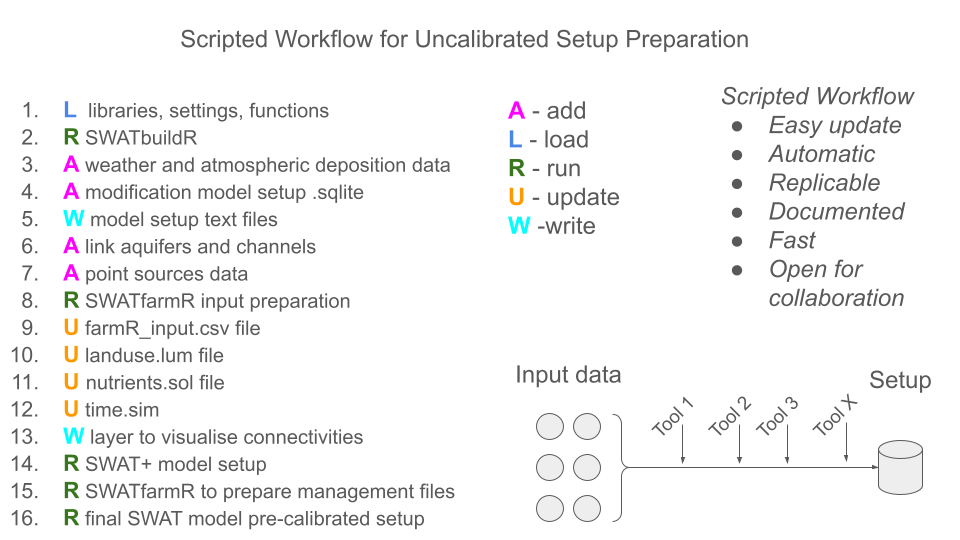

# Workflow for Uncalibrated SWAT+ Setup Preparation  

This document describes the workflow for preparing a **fully parameterised but uncalibrated SWAT+ model setup**.  
It is intended as a practical guide for researchers and practitioners working with the SWAT+ model in the context of the OPTAIN project and beyond.  

The workflow enables:  

- **Automatic and replicable setup creation** – ensuring that results are consistent across runs.  
- **Efficient regeneration** – the entire setup can be reproduced when new or corrected input data become available.  
- **Transparency** – each step is documented and can be traced back.  
- **Collaboration** – scripts and data structures are modular, enabling distributed work across teams.  

⚠️ **Important**: Input data preparation (e.g. DEM preprocessing, land use classification, or weather data formatting) is not part of this workflow. It is assumed that such data already exist in a suitable format.  

---

# Developers  

- **Svajunas Plunge** – svajunas_plunge@sggw.edu.pl  
- **Christoph Schürz** – christoph.schuerz@ufz.de  
- **Michael Strauch** – michael.strauch@ufz.de  

**Version:** 0.0.5  
**Date:** 2024-07-18  

---

# General Idea of the Workflow  

The workflow is a **scripted sequence of steps in R** that transforms prepared input data into a working SWAT+ setup.  

At a high level, the workflow:  

1. Starts from spatial and tabular input data (DEM, soils, land use, field boundaries, weather, etc.).  
2. Uses `SWATbuildR` (included in `Libraries` folder) to build the initial model database (`.sqlite`).  
3. Integrates climate data, atmospheric deposit ion, and point sources.  
4. Ensures consistency and connectivity of hydrological units, aquifers, and channels.  
5. Generates management operations and schedules via `SWATfarmR`.  
6. Writes out the SWAT+ `TxtInOut` directory with all necessary input files.  
7. Produces a **clean pre-calibrated setup** that can serve as the starting point for calibration and scenario analysis.  

---

# Workflow Diagrams  


### Scripted Workflow Sequence  

This is the overall sequence of steps in the workflow. Detailed information about packages, workflow steps, input data, SWAT+
parameters, and later model calibration, validation, etc., could be found in the [SWAT+ modeling protocol](https://doi.org/10.5281/zenodo.7463395)

<div class="figure">

<p class="caption">plot of chunk unnamed-chunk-1</p>
</div>

---

# Requirements  

## Software  

- **R (≥ 4.0.0)**  
- Required R packages:  

- [`SWATprepR`](https://biopsichas.github.io/SWATprepR/) – pre-processing and setup handling  
- [`SWATfarmR`](https://chrisschuerz.github.io/SWATfarmR/) – farm management and operations input  
- [`SWATtunR`](https://github.com/chrisschuerz/SWATtunR) – parameter tuning and editing  
- [`SWATdoctR`](https://github.com/chrisschuerz/SWATdoctR) – documentation and checks  
- plus standard packages such as `RSQLite`, `dplyr`, `readr`  

- **SWAT+ executables** (`swat.exe` and `write.exe`) must be available in the project folder.  

## Input Data  

The workflow assumes that the following datasets are already prepared:  

- **Spatial data**: DEM, land use map, soil map, and field boundaries  
- **Tabular data**: crop definitions, soil parameters, and nutrient data  
- **Climate data**: weather time series and (if available) atmospheric deposition  
- **Point sources**: wastewater or other discharges to the river network  

These datasets are the foundation for building the `.sqlite` model database.  

---

# Step-by-Step Workflow  

This section describes the workflow in detail. The main goal is to present what happens in each step.  

## Step 1 – Project Setup  

The workflow begins by loading required libraries and defining project paths (e.g. input data directory, results directory, and library path). A clean results folder is created to avoid conflicts with previous runs.  

Installation of required packages is needed, if not already installed. This code could be used to do this.

``` r
install.packages(c("RSQLite", "dplyr", "readr"))

# Project-specific packages
devtools::install_github("biopsichas/SWATprepR")
devtools::install_github("chrisschuerz/SWATfarmR")
devtools::install_github("biopsichas/SWATtunR")
devtools::install_github("chrisschuerz/SWATdoctR")
```

## Step 2 – Base Model Generation with SWATbuildR  

`SWATbuildR` provides functions that create the initial SWAT+ database (`project.sqlite`). This database contains essential SWAT+ input information, including hydrological response units (HRUs), the routing structure, basic connections derived from spatial data, etc.

## Step 3 – Adding Climate and Deposition Data  

Weather series are linked to subbasins, and weather generator statistics are prepared with `SWATprepR`. If available, atmospheric deposition is downloaded and added as annual or monthly values. At this stage, the model can already simulate hydrology, but management and nutrient processes are still missing.  

## Step 4 – Modifying the Project Database  

Before writing out text files, the database is adjusted to ensure compatibility with `write.exe`.  

## Step 5 – Writing Input Files  

With `write.exe`, the `.sqlite` database is translated into the standard SWAT+ text input files. This produces a complete `TxtInOut` directory.  

## Step 6 – Ensuring Connectivity  

All aquifers are linked to channels to avoid water storage without outlets. 

## Step 7 – Adding Point Sources  

If point source data exist (e.g. wastewater treatment plant discharges), they are incorporated with `SWATprepR` at this stage. This ensures realistic flow and nutrient loading.  

## Step 8 – Preparing Farm Management Input  

The model needs management schedules for crops, fertilisation, and tillage. `SWATfarmR input` preparation script (included in `Libraries` folder) is used to create the `farmR_input.csv` file, which later becomes the basis for management schedules, which later are generated with `SWATfamrR`.  

## Step 9 - 12 – Updating Model Files  

Several model text files are updated to ensure consistency with the project-specific data:  

- `farmR_input.csv` – crop rotations and operations  
- `landuse.lum` – land use parameters  
- `nutrients.sol` and `hru-data.hru` – soil nutrient contents  
- `time.sim` – simulation start and end dates  

## Step 13 – Visualising and Adjusting Connectivity  

A shapefile of the routing network is generated, which allows the modeller to visually inspect and, if necessary, manually correct the `rout_unit.con` file. Connectivity between units is checked using a shapefile output (`land_connections_as_lines.shp`). Manual corrections may be required, particularly for routing inconsistencies.  

## Step 14 – Running SWAT+

The model is executed once to verify consistency. 

## Step 15 – Generating Farm Management Schedules

Then, management schedules are generated automatically with `SWATfarmR`. 

## Step 16 – Producing the Clean Pre-Calibrated Setup  

Finally, a clean version of the model setup is produced:  

- Redundant files are removed  
- Input files are organised into `clean_setup/`  
- A calibration template file (`calibration.cal`) could be added, if available.  

At this point, the model is ready for calibration.  

---

# Output  

At the end of the workflow, you will obtain:  

- `project.sqlite` – SWAT+ database
- `TxtInOut/` – SWAT+ input files as well as GIS files (reaches, basin, hrus) in the `data` folder.  
- `farmR_input/` – farm management schedules  
- `clean_setup/` – cleaned setup without temporary files  

---

# Notes and Manual Checks  

- **Connectivity (`rout_unit.con`)** may require manual edits.  
- For calibration, continue with [`SWATtunR`](https://biopsichas.github.io/SWATtunR/) or other tools.
- For setup verification, continue with [`SWATdoct workflow`](https://biopsichas.github.io/SWATtunR/articles/qa.html) 
---

# References  

- [SWATprepR documentation](https://biopsichas.github.io/SWATprepR/)  
- [SWATfarmR documentation](https://chrisschuerz.github.io/SWATfarmR/)  
- [SWAT+ official resources](https://swat.tamu.edu/)  
- [SWATtunR documentation](https://biopsichas.github.io/SWATtunR/)

---

# Contact  

For support and collaboration:  

- Svajunas Plunge – svajunas_plunge@sggw.edu.pl  
